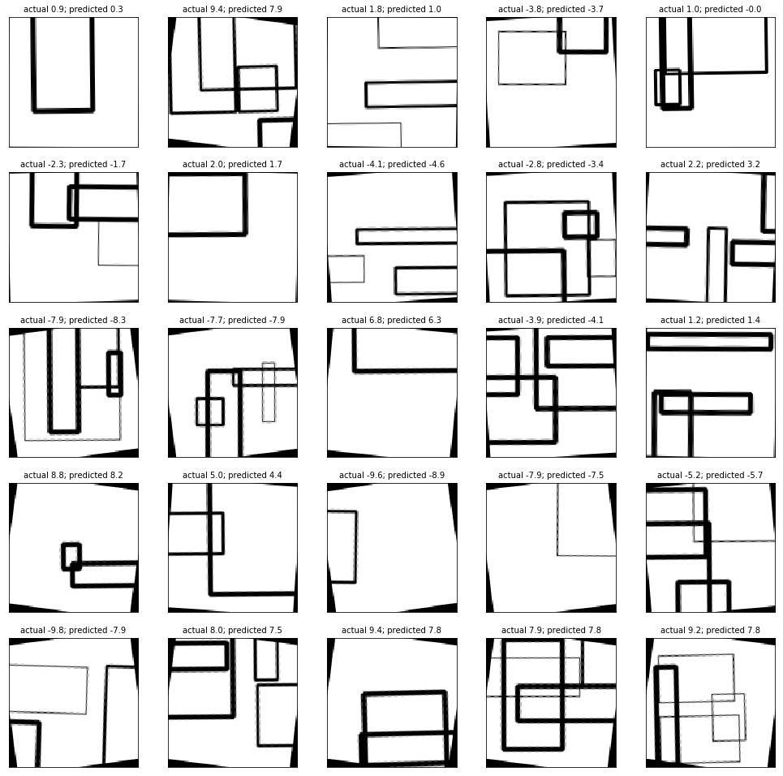

# Rotation-angle-prediction
The main goal of this project is to build a tensorflow model which predicts an angle of an image rotation. This model takes an RGB image with rotated rectangles on it as input and gives this angle of rotatin as output.
# Description of the input images:
  * The size of the an input image is 128x128
  * Training set has 10000 images
  * Each image has from 1 to 10 rectangles
  * The width and height of each rectangle ranges from 0.1 to 1 of width and height of the initial image
  * Width of the rectangle's borders ranges between 1 and 5 pixels
  * The center of each rectangle can be in any pixel of the initial image
  * The pattern of this rectangles randomly rotates between -10 and 10 degrees
# Solution
Solution consists of two ipython notebooks. The first is data_generator([here](https://github.com/NevzaimnayaLove/angle-prediction/blob/master/Generator.ipynb)) with examples of generated images. And the second is model with a code for CNN's training and training results including loss function's plot ([here](https://github.com/NevzaimnayaLove/angle-prediction/blob/master/Povorot.ipynb). This notebook also include results on test set as the final goal of this project.

# Used libraries
 * NumPy
 * Pandas
 * PIL
 * Tensorflow
 * Random
